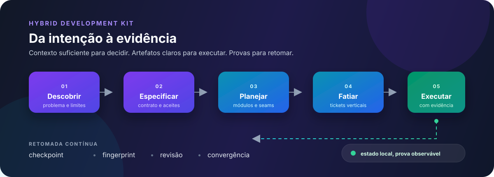
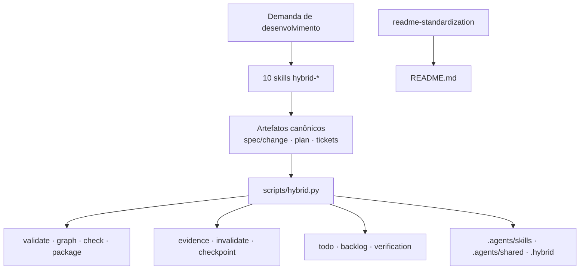

<div align="center">

# Dev Skills

**Coleção local de skills para conduzir desenvolvimento, especificação, verificação e documentação de projetos.**

[](#requisitos)
[](#hybrid-spec-kit)
[](#visão-técnica)
[](https://github.com/VIDORETTO/dev-skills/commits/main)

[Hybrid Spec Kit](#hybrid-spec-kit) · [README Standardization](#readme-standardization) · [Instalação](#instalação) · [Uso](#uso) · [Desenvolvimento](#desenvolvimento)

</div>

<p align="center">
  
</p>

## 📖 Sobre o repositório

Este repositório reúne skills locais reutilizáveis para trabalhos de desenvolvimento assistidos por agentes. Ele não é uma aplicação única nem um pacote publicado em um registry: cada componente é distribuído como uma pasta com `SKILL.md`, referências e, no caso do Hybrid Spec Kit, um runtime Python local.

O conjunto atual tem dois componentes independentes:

| Componente | O que entrega | Ponto de entrada |
| --- | --- | --- |
| [`hybrid-spec-kit`](./hybrid-spec-kit/README.md) | Dez skills para descobrir, especificar, planejar, fatiar, implementar e revisar mudanças, com um runner determinístico. Otimizado para custo: um filtro de escopo deixa pedidos pequenos fora do kit ([estudo](./hybrid-spec-kit/README.md#custo-e-eficiência-kit-pesado--hybrid)). | `hybrid-spec-kit/skills/*/SKILL.md` e `hybrid-spec-kit/scripts/hybrid.py` |
| [`readme-standardization-skill`](./readme-standardization-skill/SKILL.md) | Uma skill para analisar um repositório e criar ou padronizar seu README em quatro camadas. | `readme-standardization-skill/SKILL.md`, nome `readme-standardization` |

O objetivo é manter o julgamento semântico nas skills e deixar fatos verificáveis — estrutura, IDs, referências, grafos, projeções, fingerprints, evidências e checkpoints — sob um runtime local reproduzível quando esse runtime existir.

## ✨ O que você encontra

- Um fluxo completo para transformar uma demanda vaga em contrato, plano, tickets verticais e evidência atual.
- Perfis `compact`, `standard` e `expanded`, escolhidos por incerteza, risco e necessidade de coordenação.
- Artefatos com ownership explícito: `spec.md`/`change.md`, `plan.md`, tickets, `state.json`, evidências e achados.
- Validações determinísticas para referências, IDs, schemas, dependências, ciclos, projeções e prontidão de pacotes.
- Uma skill de README que não inventa comandos, versões, badges, arquitetura, licença ou roadmap.
- Exemplos documentais e uma suíte local de 49 testes para o runtime do Hybrid Spec Kit, além de um harness A/B (`scripts/bench_ab.py`) para medir o overhead contra o uso sem skill.

## 🧠 Como funciona

No Hybrid Spec Kit, uma demanda passa por etapas com responsabilidades diferentes. As skills produzem ou orientam artefatos canônicos; o runner valida relações que podem ser verificadas sem substituir decisões humanas ou do agente.

```text
demanda
  │
  ▼
reconhecimento → descoberta → domínio → especificação
                                      │
                                      ▼
                              plano → fatias → check
                                                  │
                                                  ▼
                                  implementação → verificação → revisão
                                                  │
                                                  ▼
                                      checkpoint + evidência atual
```

A `readme-standardization` usa um pipeline separado:

```text
analisar → modelar → selecionar seções → gerar → validar
```

Ela organiza o README em `Identity → End-User → Technical → Project/Community` e só inclui seções sustentadas por arquivos, configuração, código, testes ou fontes verificadas.

## 📋 Requisitos

- Python 3.10 ou posterior para executar o runner em [`hybrid-spec-kit/scripts/hybrid.py`](./hybrid-spec-kit/scripts/hybrid.py). O código usa apenas a biblioteca padrão.
- Git é opcional para o runner, mas permite registrar um SHA como baseline quando o projeto consumidor possui commits.
- Um host de agente capaz de carregar skills locais no formato `SKILL.md` para invocar as skills.
- Não há `package.json`, `pyproject.toml`, `requirements.txt`, Dockerfile ou outro manifesto de dependências neste repositório.

## 📦 Instalação

### Validar o kit no clone

```powershell
git clone https://github.com/VIDORETTO/dev-skills.git
cd dev-skills/hybrid-spec-kit

python scripts/hybrid.py package-validate --json
python -m unittest discover -s tests -v
```

`package-validate` verifica as dez skills, frontmatter, referências relativas, schemas e compilação do runner. A suíte usa `unittest` e cria fixtures temporários para testar instalação, validação, grafos, projeções, checkpoints, evidências e gates.

### Instalar o Hybrid Spec Kit em um projeto

Partindo da pasta `hybrid-spec-kit`:

```powershell
python scripts/hybrid.py install `
  --project C:\caminho\do\projeto `
  --json
```

Por padrão, a instalação copia:

| Destino no projeto consumidor | Conteúdo |
| --- | --- |
| `.agents/skills` (ou `.claude/skills`, se existir) | As dez pastas `hybrid-*` com `SKILL.md` e `agents/openai.yaml` |
| `.agents/shared` | Referências compartilhadas |
| `.hybrid/shared` | Cópia das referências usada pelo runtime instalado |
| `.hybrid/hybrid.py` | Runner local do projeto |

Use `--skill-root .cursor/skills` quando o host usar outra convenção. Arquivos diferentes já existentes geram conflito e são preservados; use `--force` somente depois de revisar o inventário retornado.

### Disponibilizar a skill de README

`readme-standardization-skill` é mantida separada na raiz e não é copiada pelo comando `hybrid-spec-kit/scripts/hybrid.py install`. Disponibilize a pasta no diretório de skills aceito pelo seu host de agente e carregue [`SKILL.md`](./readme-standardization-skill/SKILL.md). O nome declarado pela skill é `readme-standardization`.

## 🚀 Quick Start

Depois de instalar o Hybrid Spec Kit no projeto consumidor:

```powershell
cd C:\caminho\do\projeto

python .hybrid/hybrid.py init `
  --project . `
  --mode standard `
  --json
```

Em seguida, invoque `/hybrid-start` (Claude Code) ou `$hybrid-start` (Codex) com a demanda. Ele decide primeiro se o pedido precisa do kit: pedidos pequenos seguem como trabalho direto. Nos demais, recomenda a primeira etapa ainda necessária e retoma esforços existentes com uma única chamada (`next`).

Para uma mudança pequena e bem conhecida, inicialize com `--mode compact`. Para múltiplos comportamentos, módulos, persistência ou coordenação, use `standard`. O modo `expanded` é reservado para incerteza alta, compatibilidade pública, migrações difíceis ou dados de maior impacto.

## 🧑‍💻 Uso

### Hybrid Spec Kit

As dez skills são complementares; cada uma tem um escopo explícito e termina com artefatos, achados, evidências e uma próxima ação.

| Skill | Quando usar | Resultado principal |
| --- | --- | --- |
| [`hybrid-start`](./hybrid-spec-kit/skills/hybrid-start/SKILL.md) | Início, retomada ou triagem de qualquer demanda. | Rota, reconhecimento, baseline e próximo passo. |
| [`hybrid-discover`](./hybrid-spec-kit/skills/hybrid-discover/SKILL.md) | Ideia vaga, bug ambíguo, pesquisa, protótipo ou migração com dúvidas. | Problema, consumidores, escopo, hipóteses, decisões e perguntas materiais. |
| [`hybrid-domain`](./hybrid-spec-kit/skills/hybrid-domain/SKILL.md) | Termo resolvido ou decisão difícil de reverter. | `CONTEXT.md`/`CONTEXT-MAP.md` e ADRs seletivos. |
| [`hybrid-specify`](./hybrid-spec-kit/skills/hybrid-specify/SKILL.md) | Comportamento precisa virar contrato verificável. | `spec.md` ou `change.md` com `FR-xxx` e `AC-xxx`. |
| [`hybrid-plan`](./hybrid-spec-kit/skills/hybrid-plan/SKILL.md) | O contrato aceito precisa de desenho técnico. | `plan.md`, módulos, interfaces, seams, riscos e verificação. |
| [`hybrid-slice`](./hybrid-spec-kit/skills/hybrid-slice/SKILL.md) | O plano está pronto para execução incremental. | Tickets verticais, dependências, sequência e pacotes executáveis. |
| [`hybrid-check`](./hybrid-spec-kit/skills/hybrid-check/SKILL.md) | Antes da execução ou depois de mudanças nos artefatos. | Checks de `consistency`/`convergence`, lacunas e deduplicação. |
| [`hybrid-implement`](./hybrid-spec-kit/skills/hybrid-implement/SKILL.md) | Um ticket `ready` pode ser executado. | Mudança mínima, testes por comportamento e checkpoint. |
| [`hybrid-verify`](./hybrid-spec-kit/skills/hybrid-verify/SKILL.md) | O comportamento implementado precisa de prova atual. | Evidências `EV-xxx`, revisão testada e limitações. |
| [`hybrid-review`](./hybrid-spec-kit/skills/hybrid-review/SKILL.md) | Uma mudança precisa ser revisada em baseline fixo. | Relatório separado de `Standards` e `Spec`. |

### Comandos do runner

Execute os comandos a partir de `hybrid-spec-kit` antes da instalação ou a partir do projeto consumidor depois de instalar `.hybrid/hybrid.py`.

| Comando | Finalidade |
| --- | --- |
| `package-validate` | Validar a integridade do pacote distribuível. |
| `install` | Copiar skills, referências compartilhadas e runtime para um projeto. |
| `init` | Criar configuração e checkpoint inicial do projeto consumidor. |
| `scaffold` | Criar um esforço `standard` ou `compact`. |
| `next-id` | Calcular o próximo ID estável (`TK`, `FR`, `AC`, `EV` ou `FD`). |
| `validate` | Validar configuração, frontmatter, IDs, referências, campos e caminhos. |
| `graph` | Inspecionar dependências, ciclos, fronteira e áreas sobrepostas dos tickets. |
| `render` | Gerar projeções `todo.md`, `backlog.md` e `verification.md` quando aplicável. |
| `package` | Verificar e, com `--write`, emitir o pacote de execução de um ticket. |
| `ticket update` | Atualizar estado e status de verificação sem alterar o contrato. |
| `evidence add` | Registrar procedimento, execução, resultado, caminhos, fingerprint e limitações. |
| `start` | Ler contexto, baseline, checkpoint e inputs alterados. |
| `session` | Sugerir um marco limitado e, com `--write`, gerar prompt de continuação com controle de crescimento de tickets. |
| `invalidate` | Encontrar evidências potencialmente obsoletas e, com `--write`, marcá-las. |
| `check` | Analisar consistência ou convergência sem editar a spec. |
| `checkpoint write` | Persistir posição, revisão, inputs e próxima ação com guarda otimista. |
| `finding add` / `dedupe` | Registrar e deduplicar lacunas de revisão ou convergência. |

Exemplo de preparação de um esforço:

```powershell
python .hybrid/hybrid.py scaffold `
  --project . `
  --effort 014-reserva-estoque `
  --title "Reserva de estoque" `
  --json

python .hybrid/hybrid.py validate `
  --project . `
  --effort 014-reserva-estoque `
  --json

python .hybrid/hybrid.py graph `
  --project . `
  --effort 014-reserva-estoque `
  --json
```

Para entregar um ticket a uma sessão nova:

```powershell
python .hybrid/hybrid.py package `
  --project . `
  --effort 014-reserva-estoque `
  --ticket TK-001 `
  --json
```

`ready: true` exige contrato aceito, plano pronto, revisões atuais, blockers satisfeitos e pacote completo. A executora não deve marcar `done` sem evidência passada e o gate de revisão.

### README Standardization

A skill [`readme-standardization`](./readme-standardization-skill/SKILL.md) é dedicada a documentação de repositórios. Ela segue estas etapas:

1. Descobrir arquivos, manifests, comandos, testes, assets, CI, deployment, licença e canais declarados.
2. Classificar o projeto e construir um modelo interno com fatos verificáveis.
3. Selecionar somente seções sustentadas por evidência.
4. Gerar o README em quatro camadas: identidade, uso, documentação técnica e projeto/comunidade.
5. Validar links, comandos, badges, estrutura, claims, licença e ausência de seções vazias.

Use-a quando precisar criar, modernizar, padronizar ou revisar um README. Ela preserva conteúdo comprovado, remove claims não verificáveis e declara explicitamente quando o repositório não fornece uma informação — por exemplo, licença, CI ou mecanismo de deployment.

### Artefatos e fontes de verdade

No perfil padrão, a fonte canônica é:

| Artefato | Responsabilidade |
| --- | --- |
| `spec.md` | Comportamento, requisitos e critérios de aceite. |
| `plan.md` | Desenho técnico, interfaces, compatibilidade e verificação. |
| `tickets/TK-xxx.md` | Uma fatia executável, suas tarefas e seu estado. |
| `state.json` | Checkpoint do esforço, baseline, inputs, revisão e próxima ação. |
| Evidência `EV-xxx` | Resultado observado, ambiente, revisão e limitações. |
| Achado `FD-xxx` | Lacuna acionável de consistência, convergência, standards ou spec. |

`todo.md`, `backlog.md` e `verification.md` são projeções geradas. Edite a fonte canônica e gere novamente; não mantenha listas concorrentes.

## 🔧 Technical Documentation

## 🏗️ Visão técnica

| Camada | Implementação verificada |
| --- | --- |
| Tipo de projeto | Coleção local de AI skills com runtime/CLI determinístico |
| Runtime | Python 3.10+ |
| Dependências do runner | Biblioteca padrão do Python |
| Artefatos | Markdown, JSON e SVG |
| Persistência | Arquivos locais no projeto consumidor |
| Testes | `unittest`, 32 testes no conjunto atual |
| Integrações remotas | Nenhum tracker remoto, publicação, merge ou deploy no runtime v1 |

O runner calcula invariantes locais e não decide semanticamente se uma alteração atende ao produto. As skills continuam responsáveis por julgamento, perguntas materiais, desenho, execução contextual e revisão.

## 🏛️ Arquitetura



O pacote Hybrid mantém as referências compartilhadas em `shared/`, as dez skills em `skills/`, o runner em `scripts/` e testes/fixtures em `tests/` e `examples/`. A instalação copia esses recursos para o projeto adotado, sem alterar automaticamente a configuração pessoal do host.

## 📁 Estrutura do repositório

```text
.
├── README.md
├── hybrid-spec-kit/
│   ├── README.md
│   ├── assets/
│   │   └── hybrid-workflow.svg
│   ├── docs/
│   ├── examples/
│   ├── scripts/
│   │   └── hybrid.py
│   ├── shared/
│   │   ├── references/
│   │   ├── schemas/
│   │   └── templates/
│   ├── skills/
│   │   ├── hybrid-check/
│   │   ├── hybrid-discover/
│   │   ├── hybrid-domain/
│   │   ├── hybrid-implement/
│   │   ├── hybrid-plan/
│   │   ├── hybrid-review/
│   │   ├── hybrid-slice/
│   │   ├── hybrid-specify/
│   │   ├── hybrid-start/
│   │   └── hybrid-verify/
│   └── tests/
│       └── test_runner.py
├── readme-standardization-skill/
│   ├── SKILL.md
│   └── references/
└── .gitignore
```

Documentação mais detalhada:

- [`hybrid-spec-kit/docs/usage.md`](./hybrid-spec-kit/docs/usage.md) — operação passo a passo.
- [`hybrid-spec-kit/docs/evaluation.md`](./hybrid-spec-kit/docs/evaluation.md) — casos E01–E31.
- [`hybrid-spec-kit/docs/validation-report.md`](./hybrid-spec-kit/docs/validation-report.md) — validações registradas.
- [`hybrid-spec-kit/docs/sources.md`](./hybrid-spec-kit/docs/sources.md) — proveniência e adaptações.
- [`readme-standardization-skill/references/`](./readme-standardization-skill/references/) — workflow, tipos de projeto, seções, estilo e quality gate do README.

## 🧑‍🔧 Desenvolvimento

Não há manifesto de dependências, build de produção, CI ou deployment configurado. Para contribuir localmente:

```powershell
cd hybrid-spec-kit
python scripts/hybrid.py package-validate --json
python -m unittest discover -s tests -v
```

Ao alterar o protocolo:

- preserve a separação entre artefatos canônicos e projeções;
- mantenha IDs estáveis e referências verificáveis;
- atualize schemas, templates, exemplos ou casos de avaliação afetados;
- registre limitações de execução em vez de promover resultado não executado a `passed`;
- não altere `spec.md`, `plan.md` ou tickets para esconder uma lacuna detectada.

## 🧪 Testes

O conjunto atual usa a biblioteca `unittest` e exercita:

- validação do layout do pacote;
- exemplos padrão e compacto;
- configuração e scaffolding;
- baseline Git e preservação de alterações locais;
- grafos, ciclos e áreas sobrepostas;
- projeções idempotentes e conflitos de escrita;
- evidências, fingerprints e invalidação;
- checkpoints atômicos com revisão esperada;
- gates de pacote e transições de ticket;
- instalação, conflitos e proteção contra caminhos fora do projeto;
- manifesto de avaliação E01–E31.

Comando completo:

```powershell
python -m unittest discover -s tests -v
```

## ⚠️ Limitações atuais

- O Hybrid Spec Kit é local; não inclui adapter de tracker remoto, GUI, publicação, merge, deploy ou instalação global.
- Os caminhos de código dos exemplos são ilustrativos e precisam ser confirmados no projeto consumidor.
- A avaliação E01–E31 prepara subchecks determinísticos, mas os casos que exigem julgamento de uma IA ainda dependem de uma execução comportamental autorizada.
- Não há manifestos de dependências, pipeline CI/CD, mecanismo de release ou arquivo de licença neste repositório.

## 🤝 Contribuindo

Antes de enviar uma mudança:

1. execute `package-validate` e a suíte de testes;
2. mantenha a fonte de verdade separada das projeções;
3. atualize documentação e exemplos quando comandos ou invariantes mudarem;
4. preserve a distinção entre comportamento aceito, desenho técnico, evidência observada e estado do ticket;
5. documente a limitação quando um procedimento não puder ser executado.

Não existe `CONTRIBUTING.md` neste repositório; estas regras refletem as instruções e os documentos operacionais presentes no `hybrid-spec-kit`.

## 💬 Suporte

Nenhum canal formal de suporte, arquivo `SUPPORT.md`, `SECURITY.md` ou política de atendimento foi declarado nos arquivos do repositório. Para entender o comportamento do Hybrid Spec Kit, comece por [`hybrid-spec-kit/docs/usage.md`](./hybrid-spec-kit/docs/usage.md) e pelas skills específicas.

## 📄 Licença

Nenhum arquivo `LICENSE`, `LICENSE.md` ou `LICENSE.txt` foi encontrado neste repositório. Os termos de uso e redistribuição não estão declarados aqui.
