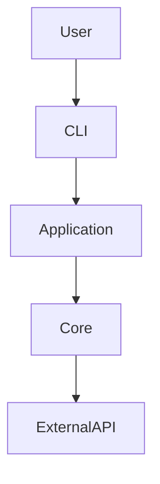

# Section Library

Every section is classified MUST / SHOULD / CONDITIONAL. Never include a section — of any classification — with no supporting evidence; adapt or omit instead of padding.

## Classification

**MUST** (default core structure; if one truly doesn't apply, adapt rather than fake it):
Logo/visual identity, Project name, Tagline, Badges, About, Features/capabilities, How It Works (simple), Installation/Getting Started, Usage, Technical Overview, Project Structure, Support information, License status.

**SHOULD** (include when evidenced):
Screenshot/demo, Quick navigation, Table of contents, Requirements, Configuration, Quick Start, Examples, Update, Uninstallation, Troubleshooting, Architecture, Development, Testing, Contributing, Limitations.

**CONDITIONAL** (only when clearly relevant and evidenced):
FAQ, API, Data Model, Docker, Deployment, CI/CD, Benchmarks/Performance, Migration, Roadmap, Changelog, Release process, Plugin development, SDK examples, Cloud setup, Internationalization, Observability/Telemetry, Security details.

## Canonical order (section library, not a mandatory 42-heading template)

```text
01 Logo               08 Features            15 Examples           22 Tech Stack        29 Testing          36 Roadmap
02 Project Name        09 How It Works Simple 16 Update             23 Architecture      30 Build            37 Contributing
03 Tagline            10 Requirements         17 Uninstallation      24 Project Structure 31 Deployment       38 Support
04 Badges             11 Installation         18 Troubleshooting     25 Internal Flow    32 CI/CD             39 Changelog/Releases
05 Quick Links        12 Configuration        19 FAQ                 26 Data Model        33 Security         40 Maintainers
06 Hero Image/Demo     13 Quick Start        ── divider ──          27 API/Interfaces    34 Performance      41 Acknowledgements
07 About               14 Usage               20-21 Tech Overview   28 Development       35 Limitations      42 License
```

Only emit headings that improve the documentation for this specific project. A minimal library gets ~10 sections; a large platform may reasonably use 25+.

## Layer → section mapping

- **Layer 1 (Hero)**: 01–06
- **Layer 2 (End User)**: 07–19
- **Layer 3 (Technical)**: 20–35 (preceded by the divider, see below)
- **Layer 4 (Project/Community)**: 36–42

## Technical divider

Between Layer 2 and Layer 3, always insert:

```markdown
---

# 🔧 Technical Documentation
```

Everything above is for using the project. Everything below is for understanding/developing/maintaining it.

---

## Per-section rules

### Hero (Logo, Name, Tagline, Badges, Quick Links, Hero image)

```html
<div align="center">

[LOGO]

# Project Name

**One-sentence tagline explaining exactly what the project does.**

[BADGES]

[Quick navigation links]

</div>
```
Then optionally a screenshot/demo GIF/banner. The hero must communicate identity, purpose, status, main technology, navigation, and visual preview — nothing more. See `style-guide.md` for logo/badge/tagline rules in detail.

### 📖 About
Explain in plain language: what it is, what problem it solves, who it's for, why it exists, when to use it. Do not open with implementation details unless the project *is* infrastructure/tooling where that's the point.

### ✨ Features
Concrete capabilities, not adjectives. Bad: "Fast, Modern, Powerful, Easy." Good: "Processes multiple files in a single command", "Supports PNG, JPEG, and WebP", "Runs on Windows, macOS, and Linux." Performance/security/scalability claims require evidence (benchmarks, config, test results) or must be dropped.

### 🧠 How It Works (simple)
User-facing, no internals. Use an input→process→result diagram or a 2–4 step plain-language sequence. Someone who hasn't read the source should understand it.

### 📋 Requirements
Only verified runtime/tooling requirements from engines/manifests/Dockerfiles/CI matrices. Never guess a minimum version.

### 📦 Installation
Order: recommended method → alternatives → verification command (e.g. `project --version`). Every command must come from real manifest/registry evidence — never invent a package name or registry command.

### ⚙️ Configuration
Separate from Installation. Cover `.env`/config files/keys/ports/paths/flags/profiles. Use a table for environment variables:
```markdown
| Variable | Required | Default | Description |
|---|---|---|---|
| `API_URL` | Yes | — | API base URL |
| `PORT` | No | `3000` | HTTP port |
```
Use placeholders (`YOUR_API_KEY`, `example-token`) — never real secrets found in the repo, even if committed by mistake (flag that separately as a security concern, don't reproduce it).

### 🚀 Quick Start
Smallest reasonable path from zero to a first successful result: install → configure (if needed) → run → expected result. Every command copyable and real.

### 🧑‍💻 Usage
Simplest use case first, then common examples, options, advanced usage — adapted to project type (CLI invocation, library import, API request/response, GUI steps, or agent prompt→workflow→output). Never explain internals here.

### Examples
Complete, runnable, contextual. Show expected output when useful. No fragments missing required context.

### ⬆️ Updating
Only if a real update mechanism exists (package manager update command, self-update flag, etc.).

### 🗑️ Uninstallation
Strongly recommended for installable software. Cover: remove package/binary; remove optional config; remove optional cache/local data — but only name directories the repository confirms.

### 🛠️ Troubleshooting
Real, common, verifiable failure modes (command not found, permission denied, missing config, port in use, unsupported runtime, connection failure). Move long guides to `/docs` and summarize here.

### ❓ FAQ
Conditional. Only genuinely useful questions grounded in the repo/issues/docs — never invented filler questions.

### 🏗️ Technical Overview
Primary language, runtime, framework, database, key libraries, protocols, storage, external services — verified only. Table format works well:
```markdown
| Layer | Technology |
|---|---|
| Runtime | Node.js |
| API | Fastify |
| Database | PostgreSQL |
```

### Tech Stack
Use only if there's enough architecturally-relevant technology to justify a dedicated section beyond the Technical Overview table. Prioritize architectural choices over listing every dependency.

### 🏛️ Architecture
Explain real components and their interactions. Prefer a Mermaid `flowchart` for multi-component systems:

Never depict a component that isn't in the codebase.

### 📁 Project Structure
Show only meaningful directories/files, not a full tree dump:
```text
project/
├── src/
│   ├── core/
│   ├── cli/
│   └── utils/
├── tests/
├── docs/
├── assets/
└── README.md
```
Annotate important directories briefly. Never include a path that doesn't exist.

### 🔄 Internal Flow
Only if it adds understanding beyond Architecture — useful for pipelines/compilers/APIs/agents. Example: `Input → Parser → Validation → Business Logic → Output`.

### 🗄️ Data Model
Conditional — databases/schemas/domain entities. Keep it brief; move exhaustive schema docs to `/docs`.

### 🔌 API
Overview only: primary interfaces, a couple of important endpoints/classes/functions, auth overview, 1–2 examples. Full reference belongs in `/docs` or a dedicated file, linked from here.

### 🧑‍🔧 Development
How a contributor runs the project locally: clone → install deps → dev command. Use a real command table:
```markdown
| Command | Purpose |
|---|---|
| `npm run dev` | Start development mode |
| `npm test` | Run tests |
| `npm run lint` | Run linting |
| `npm run build` | Build production output |
```
Every command must exist in the actual manifest/Makefile.

### 🧪 Testing
Real test commands; distinguish unit/integration/e2e/coverage only if identifiable. Never state a coverage percentage unless it's actually measured and surfaced (e.g. a coverage badge tied to real CI).

### 📦 Build
Conditional — build command, output directory, requirements, generated artifacts.

### 🚀 Deployment
Conditional — only document verified mechanisms (Docker, Vercel, AWS, Cloudflare, Kubernetes, GitHub Releases, binary distribution). Never expose deployment secrets.

### 🔁 CI/CD
Only if `.github/workflows/` (or equivalent) exists — describe the real jobs, e.g. `PR → Lint → Tests → Build → Release`. Never infer CI from a badge alone.

### 🔐 Security
If `SECURITY.md` exists, summarize + link. Avoid absolute claims ("100% secure", "military-grade") unless objectively supported. Never expose credentials/tokens/keys/internal endpoints found in the repo.

### Performance / Benchmarks
Conditional — only with real benchmark evidence (environment, method, metric, version/date). Never invent numbers.

### ⚠️ Limitations
Strongly recommended when real limitations are identifiable (unsupported platforms, size limits, missing offline support, etc.). Builds trust — don't skip it out of politeness, and don't invent limitations either.

### 🗺️ Roadmap
Conditional — only from a real ROADMAP.md, project board, or documented plans referenced in the repo. Prefer linking to the canonical source over duplicating it.

### 🤝 Contributing
Concise in the README; link to `CONTRIBUTING.md` if present. Typical flow: fork → branch → change → test → PR — adapted to actual repo conventions (e.g. required commit format, CLA).

### 💬 Support
Only verified channels: GitHub Issues/Discussions, `SUPPORT.md`, documentation site, or a community channel explicitly named in the repo. Never invent a Discord/Slack that isn't referenced anywhere.

### 📜 Releases
Link to `CHANGELOG.md` or GitHub Releases rather than duplicating history in the README.

### 👥 Maintainers
Conditional — only names verifiable via CODEOWNERS/manifest `author`/explicit docs, not scraped from commit history.

### 🙏 Acknowledgements
Conditional — only credits the repo itself makes explicit (inspirations, sponsors, dependencies called out by name, research).

### 📄 License
State the exact license found in `LICENSE`, e.g. "Distributed under the MIT License. See [LICENSE](./LICENSE) for details." If no license file exists, say so plainly ("No license file was found in this repository") rather than assuming open source status from GitHub hosting alone.
